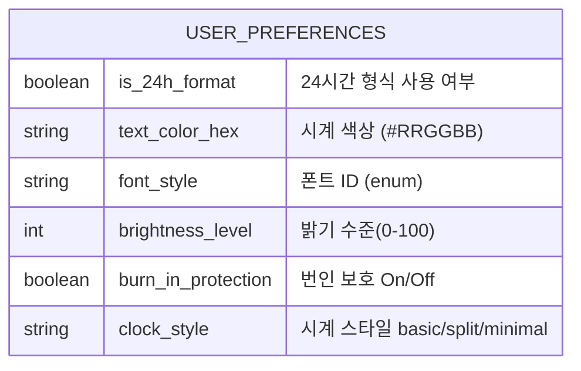

Clock Screen Saver 개발 계획서 (v1.0)

## 1. PRD (제품 요구사항)
### 1.1 제품 개요
- 제품명: Clock Screen Saver
- 목적: 안드로이드 기본 화면 보호(DreamService) 기능을 활용해 번인 걱정 없는 큰 시계 제공
- 핵심 가치: 한눈에 읽히는 대형 시계(Big & Simple), 기기 보호(Anti-Burn-in), 세련된 미니멀 디자인

### 1.2 타깃 페르소나 & 상황
- 이름: 화면 중심형 민수(30대, 사무직)
- 상황: 오래된 갤럭시 태블릿을 벽에 붙여 공용 시계로 쓰고 싶음. 터치 없이 멀리서 보기만 함.
- Pain Point: 기본/무료 시계 앱은 광고나 잡기능이 많고 화면이 지저분함. 번인 위험과 과도한 밝기도 걱정됨.
- Needs: 항상 켜두어도 번인 최소화, 멀리서도 가독성 높은 시계, 설정은 최소한으로 간단.

### 1.3 사용자 여정
1) 앱 설치 후 최초 실행 시 DreamService 권한 안내
2) 설정 화면에서 색상/폰트/24h 여부 선택, 미리보기 확인
3) 저장 후 화면 보호기 허용 → 화면 꺼짐 시 자동 실행
4) 화면 터치나 전원 버튼 입력 시 종료

### 1.4 핵심 기능 (MVP Scope)
- DreamService 기반 구동: 잠금 상태에서 시계만 표시
- HH:mm 시계 UI 중앙 배치(초 미표시)
- 시계 스타일 3종(기본/분리/미니멀) 좌·우 스와이프로 변경, 선택 상태는 저장
- 단일 탭(짧고 작은 이동)은 화면보호기 종료, 스와이프는 유지
- 1분마다 무작위 위치로 소폭 이동(Pixel Shift)하여 번인 방지
- 다크 배경 + 딤 레드/그레이 포그라운드 기본 팔레트
- 배터리 보호: AMOLED는 순수 블랙 배경, 밝기/갱신 최소화

### 1.5 성공 지표
- 연속 8시간 이상 안정 구동, 주간 크래시 0건
- 설정/동작 관련 사용자 혼란 0건(내부 UX 테스트)
- 출시 1주 내 만족도·피드백 수집 완료

### 1.6 비범위 (Non-Goals)
- 알람/타이머, 위젯/복잡 커스터마이즈
- 음악/뉴스/사진 슬라이드
- 광고 배너 삽입

## 2. TRD (기술 요구사항)
### 2.1 기술 스택
- Language: Kotlin
- Minimum SDK: Android 8.0 (API 26)
- UI Framework: Jetpack Compose
- Architecture: MVVM

### 2.2 주요 컴포넌트
- SettingsActivity: Compose 기반 설정/미리보기 화면, 시스템 화면보호기 설정 이동 버튼 제공
- ClockDreamService: `android.service.dreams.DreamService` 상속, 시계 렌더링 및 터치 분기(스와이프/탭)
- UserPreferencesRepository: DataStore(Preferences)로 색상/시간형식/밝기/번인/시계 스타일 저장

### 2.3 시간·갱신 처리
- Time Provider: `java.time` API 사용
- Tick Handler: Coroutines Flow/Ticker로 1분 단위 UI 업데이트(초 표시 필요 시만 1초 주기)

### 2.4 번인·배터리 보호
- Pixel Shift: 안전 여백(≥10%)을 두고 무작위 offset을 매 분 적용, 화면 밖 이동 방지
- AMOLED 최적화: 배경 #000000, 포그라운드는 저휘도 딤 컬러 사용
- 업데이트 최소화: onDreamingStarted에서 코루틴 시작, onDreamingStopped에서 즉시 취소

### 2.5 라이프사이클
- onDreamingStarted(): DataStore 로드 → Compose setContent → ticker 시작
- onDreamingStopped(): ticker 취소, 상태 정리

### 2.6 입력/제스처 처리
- DreamService `isInteractive=true`로 터치 소유
- 좌·우 스와이프(수평 이동 > 32dp, 수직보다 큼): 시계 스타일 전환, Dream 유지
- 단일 탭(이동 < 12dp, 300ms 이하): Dream 종료
- Compose 측에서도 pointerInput으로 스와이프 처리, 상태는 DataStore와 동기화

## 3. 사용자 플로우
```mermaid
graph TD
    Start[앱 실행] --> Perm{화면 보호기 권한?}
    Perm -- 없음 --> Guide[권한 안내]
    Guide --> Sys[안드로이드 화면 보호기 설정 이동]
    Perm -- 허용 --> Settings[설정 화면]

    subgraph SettingsScreen [설정 화면]
        Settings --> Style[스타일/색상 선택]
        Settings --> Format[시간 형식 선택(12/24h)]
        Style --> Preview[미리보기 확인]
        Format --> Preview
        Preview --> Save[DataStore 저장]
    end

    subgraph Dreaming [화면 보호기 동작]
        Trigger[충전/화면 꺼짐] --> StartDream[onDreamingStarted]
        StartDream --> Load[설정 로드]
        Load --> Render[시계 렌더링]
        Render --> Wait[1분 대기]
        Wait --> Shift[무작위 위치 이동]
        Shift --> Render
        Touch[터치/전원 입력] --> Stop[onDreamingStopped]
    end
```

## 4. DataStore 스키마
- Jetpack DataStore(Preferences) 사용; 키-값 구조:



## 5. 디자인 시스템 (초안)
- Color Palette: Background #000000, Text_Primary #E0E0E0, Text_Dim #444444, Text_Red #B00020, Accent #BB86FC
- Typography: Clock_Big 120sp+ Bold(모노 혹은 Lato), Setting_Title 20sp Bold, Setting_Body 16sp Regular
- UI 컴포넌트: 설정 화면 미리보기 카드, 단순 토글(번인 보호/24h)

## 6. Prompt 설계 (AI 협업용)
- 마일스톤 0: 프로젝트 설정/의존성
  - 프롬프트 예시: "Android Studio에서 'Clock Screen Saver' Compose 프로젝트 생성. Min SDK 26, Compose=true, dependency: ViewModel, DataStore Preferences, ConstraintLayout(Compose). 모듈 build.gradle.kts 결과만 보여줘."
- 마일스톤 1: DreamService 뼈대
  - 프롬프트 예시: "AndroidManifest에 android.permission.BIND_DREAM_SERVICE 추가하고 ClockDreamService.kt에서 DreamService 상속, setInteractive(false), setFullscreen(true) 설정. ComposeView로 검은 배경 Box에 '12:00' 표시."
- 마일스톤 2: 시계 로직 + 번인 방지
  - 프롬프트 예시: "CurrentTimeViewModel에서 kotlinx.coroutines ticker(1분)로 시간을 Flow 제공, ClockScreen Composable로 표시, 매 분 무작위 padding/offset으로 Pixel Shift 적용."
- 마일스톤 3: 설정 화면 & DataStore
  - 프롬프트 예시: "SettingsActivity에서 색상 선택 버튼(기본/Red/Gray), 24h 토글. UserPreferencesRepository(DataStore)로 저장/불러오기, DreamService에서도 설정 반영."

## 7. 코딩 컨벤션 & 협업 가이드
- Kotlin/Compose 우선, XML 미사용. Rx 대신 Coroutines/Flow.
- 문자열·색상은 strings.xml/Color.kt 등 상수화, 하드코딩 지양.
- "One Logic, One Request": 기능 단위로 프롬프트/커밋 쪼개기.
- 문제 발생 시 로그캣/에러 메시지를 함께 공유해 원인 파악.
- ADB 테스트 필요 시 단말에서 디버깅 권한 허용 여부 확인 후 진행 요청.
